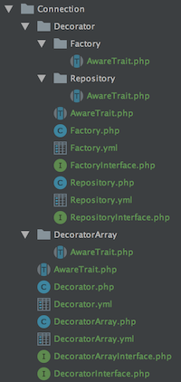

# Neighborhoods Prefab
A code generation tool.


## Apache Velocity Template Language Files

In an effort to produce pattern consistency and increase contributor velocity, we are using the Apache VTL file integration with PHPStorm as a workaround until `prefab` is in `>=` `1.0.0`.

Currently, while PHPStorm is not running,

`tools/PHPStorm/ApacheVelocityLanguage`

should be able to be copied to

`~/Library/Preferences/PhpStorm2018.1/fileTemplates`

and the copied templates will be ingested by PHPStorm when it is subsequently started.

This should work for updates to these files as well.

Room for improvement includes:
* Ingesting the files within PHPStorm, without using the filesystem directly.

### Example File System Structure



# Manual Fabrication
* copy the contents of the `http` directory into your project.
* use PHPStorm to find and replace the following
    * `Replace this with the description of your product.`
    * `replace-this-with-the-name-of-your-product` - use the same hyphenation.
    * `ReplaceWithYourProductName` - use the same casing and this does not include `Neighborhoods`.

# Configuring your PHPStorm
* Get the Symfony plugin.
* Change the plugin to generate the `PSR-4` interface DI service names by context clicking a `PHP` file > `Create Service` (at the bottom) > `Settings` > copy and paste the following > `Save`.
```javascript
var className = args.className;
var projectName = args.projectName;
var projectBasePath = args.projectBasePath;
var defaultNaming = args.defaultNaming;

// nullable
var relativePath = args.relativePath;
var absolutePath = args.absolutePath;

return className+'Interface';
```
* Configure the following to map to `Neighborhoods\ReplaceWithYourProductName` for the following including generated sources by navigating to `Preferences` > `Directories` > choose the appropriate directory > edit properties:
    * `src`
    * `fab`
* Configure the following to map to `Neighborhoods\ReplaceWithYourProductNameTest` for the following including generated sources by navigating to `Preferences` > `Directories` > choose the appropriate directory > edit properties:
    * `test`
    * `test-fab`
* Configure your TODO parser to read team notes by navigating to `Preferences` > `TODO` and add the following:
    * `\bteam\b.*`