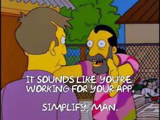

# Summary
There is an uncountable number of ways to organize and create software. These documents describe the specifications of how we organize and create our software at Neighborhoods Engineering.

This specification is called Protean, or more formally; the Protean Architecture Specification.

# Problem

# Neighborhoods Engineering Values
Protean inherits and *relies on* all of the Neighborhoods Engineering Values. These are restated here because their importance  cannot be emphasized enough.

## We Value...

### Ease of Change
Because nothing is permanent, my work must have clear boundaries, narrow scope and minimal complexity.

### The [Agile Manifesto](http://agilemanifesto.org/) and The [Unix Philosophy](https://en.wikipedia.org/wiki/Unix_philosophy)
I believe that these principles are paramount in writing good code, having healthy relationships with my team, and constantly seeking to improve our products and processes.

### The Best Solution
My success depends on our success. The best solution is the one that is best for the team.

### Skepticism of our Work
I know that mistakes are normal and common. I assume my work is broken until I prove otherwise.

### Experimentation
I must have a constant sense of curiosity and adaptability for improving myself, my work, our products, and my team. This requires me to fail fast and fail often to learn new things.

### The Pit of Success
Because others will share in my work, I must ensure that the work I produce guides my team toward good practices by making bad practices difficult.

### Ownership
I must take pride in my work and nurture it to ensure the success of my team and our company. Outstanding craftsmanship is vital to me.

# Product Group Teams
* From a technical perspective, all product group teams MUST treat each individual product as if it were a **completely seperate** company. The strongest separation MUST be maintained. This is especially difficult and the strongest discipline to this philosophical approach MUST be adhered to when several products are owned by the same product group team. 

# Interface Driven Design

## Problem
Software engineers often start writing implementations rather than starting from an Interface that describes the contracts that any given implementation may have.

## Proposed Solution
Force all implementations to require an Interface to be able to be useful in our codebases.

# Immutable Contracts
## Problem
Changing the behavior of a software contract forces clients of that contract to change their behavior(s) synchronously with the introduction of the changes to the contract.  This forms very brittle relationships between providers and clients.

## Proposed Solution
Do not mutate contracts, instead create a new contract or version an existing one.

# PSR-15 - HTTP Server Request Handlers
## Problem
This problem is identical to Dependency Injection for objects.  In this case, controllers do not provide the ability to arbitrarily inject logic to handle the abstraction of HTTP Messages (PSR-7). In addition, controllers couple our code to a particular framework.

## Proposed Solution
Use PSR-15 Server Request Handlers.

# References
* Language in all Protean documents uses [RFC 2119 Keywords](https://www.ietf.org/rfc/rfc2119.txt)
